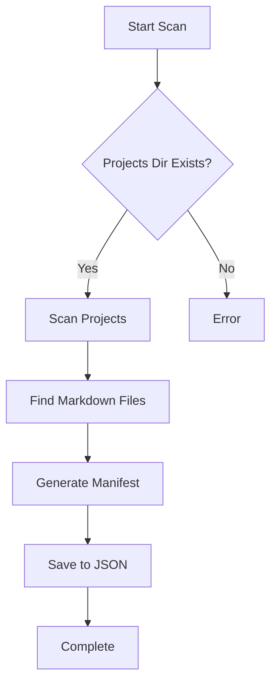
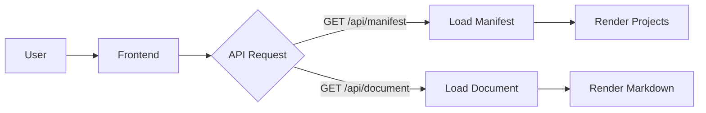
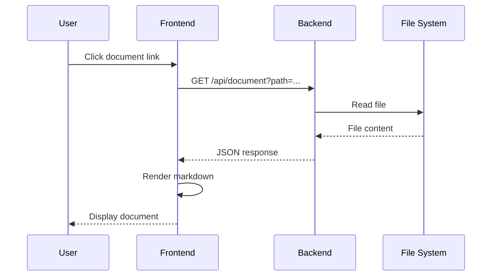

# Markdown Rendering Test

This document tests various markdown features to ensure proper rendering.

## Headers

### Level 3 Header
#### Level 4 Header
##### Level 5 Header
###### Level 6 Header

## Text Formatting

**Bold text** and *italic text* and ***bold italic text***.

~~Strikethrough text~~

`Inline code` in a paragraph.

## Lists

### Unordered List
- Item 1
- Item 2
  - Nested item 2.1
  - Nested item 2.2
- Item 3

### Ordered List
1. First item
2. Second item
3. Third item

### Task List
- [x] Completed task
- [ ] Incomplete task
- [x] Another completed task

## Links and Images

[Link to GitHub](https://github.com)

## Blockquote

> This is a blockquote.
> It can span multiple lines.
>
> And multiple paragraphs.

## Code Blocks

### Python Code
```python
def hello_world():
    """Print hello world."""
    print("Hello, World!")
    return True

# Call the function
if __name__ == "__main__":
    hello_world()
```

### JavaScript Code
```javascript
function greet(name) {
    console.log(`Hello, ${name}!`);
}

greet("World");
```

### Bash Code
```bash
#!/bin/bash
echo "Hello from bash"
ls -la | grep ".md"
```

## Tables

| Feature | Status | Priority |
|---------|--------|----------|
| Markdown Rendering | ✅ Done | High |
| Syntax Highlighting | ✅ Done | High |
| Mermaid Diagrams | ✅ Done | High |
| Search | 🔜 Planned | Medium |

## Horizontal Rule

---

## ASCII Diagram

```
┌─────────────────────────────────────────────┐
│           Browser (Frontend)                 │
│  - Project list view                         │
│  - Document viewer with markdown rendering   │
└──────────────────┬──────────────────────────┘
                   │ HTTP
                   ▼
┌─────────────────────────────────────────────┐
│        FastAPI Backend (Port 8001)           │
│  - Serve manifest                            │
│  - Serve markdown files                      │
│  - Serve static frontend                     │
└─────────────────────────────────────────────┘
```

## Mermaid Diagram



## Mermaid Flowchart



## Mermaid Sequence Diagram



## Definition List

Term 1
: Definition for term 1

Term 2
: Definition for term 2
: Another definition for term 2

## Keyboard Keys

Press <kbd>Ctrl</kbd> + <kbd>C</kbd> to copy.

Press <kbd>Ctrl</kbd> + <kbd>V</kbd> to paste.

## Nested Content

> ### Blockquote with header
>
> - List item in blockquote
> - Another item
>
> ```python
> # Code in blockquote
> print("Hello")
> ```

## Summary

This document demonstrates:
1. ✅ Headers (H1-H6)
2. ✅ Text formatting (bold, italic, strikethrough)
3. ✅ Lists (ordered, unordered, task lists)
4. ✅ Links and images
5. ✅ Blockquotes
6. ✅ Code blocks with syntax highlighting
7. ✅ Tables
8. ✅ Horizontal rules
9. ✅ ASCII diagrams in code blocks
10. ✅ Mermaid diagrams
11. ✅ Definition lists
12. ✅ Keyboard keys
13. ✅ Nested content

All features should render properly with the Phase 4 implementation!
